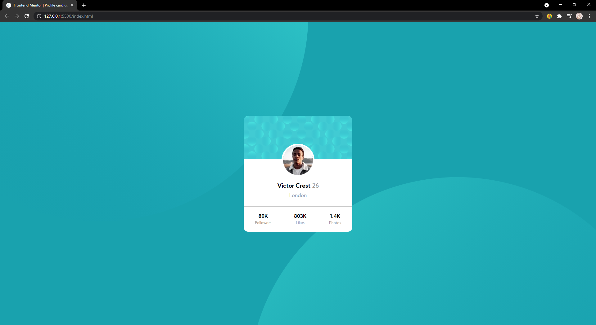

# Frontend Mentor - Profile card component

This is a solution to the [Profile card component challenge on Frontend Mentor](https://www.frontendmentor.io/challenges/profile-card-component-cfArpWshJ).

## Table of contents

- [Overview](#overview)
  - [The challenge](#the-challenge)
  - [Screenshot](#screenshot)
- [My process](#my-process)
  - [Built with](#built-with)
  - [What I learned](#what-i-learned)
  - [Useful resources](#useful-resources)
- [Author](#author)

# Overview
### The challenge

The challenge is to build out this profile card component and get it looking as close to the design as possible.

### Screenshot

My solution for the Profile card component coding challenge

Desktop preview:

Mobile preview:

# My process

### Built with

- HTML
- SASS (CSS pre-processor)
- Flexbox
- Visual Studio Code 

### What I learned
- CSS background properties

### Useful resources
 - [CSS background property](https://developer.mozilla.org/en-US/docs/Web/CSS/background)
- [Flexbox](https://developer.mozilla.org/en-US/docs/Learn/CSS/CSS_layout/Flexbox)

## Author
- Frontend Mentor - [@cristianescs](https://www.frontendmentor.io/profile/cristianescs).